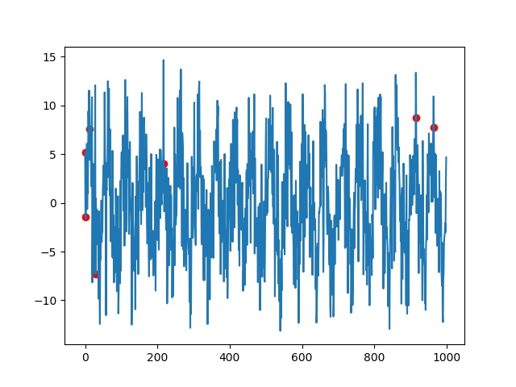

# PeaksDetection Algo

**reference**
> An Efficient Algorithm for Automatic Peak Detection in Noisy Periodic and Quasi-Periodic Signals
 
**思路**

多尺度滑动窗口+获取局部最值

**文件说明**
> PeakDetect.py 实现
> 
> refernce.py 网上实现

**添加分支**
>function 分支为添加新功能测试所用分支

**结果**

